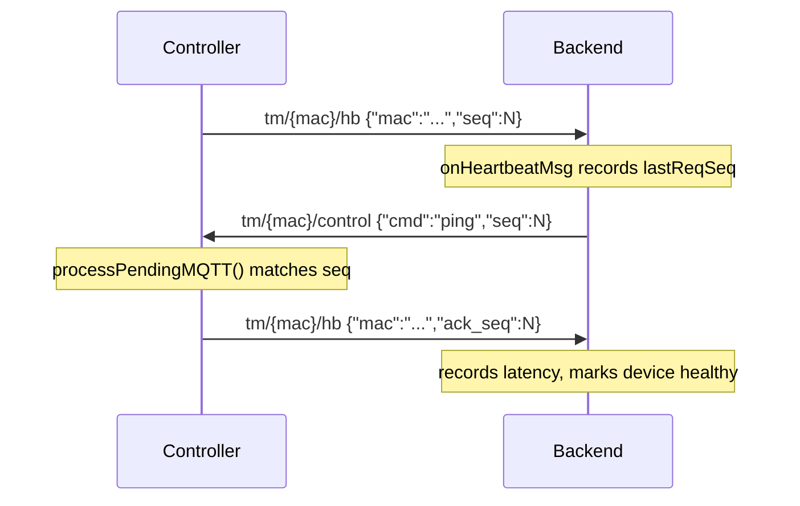
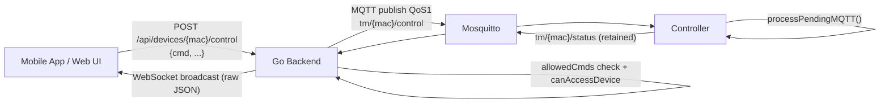

# TankMonitor — MQTT Protocol Reference

Describes every MQTT topic used between the **ESP32-S3 controller firmware**
(`controller_firmware/src/MQTTManager.cpp`) and the **Go backend**
(`web/backend/mqtt.go`, `heartbeat.go`, `ota.go`, `ws.go`), including payload
schemas, QoS/retain flags, and the end-to-end flow for client commands
(mobile app / web UI → backend → controller).

Broker: Mosquitto, `tm-<host>:1883` (see README for current address). Backend
client ID `tankmonitor-platform`; controller client ID `esp32_<last6hexMAC>`.

---

## 1. Topic namespace

All topics are per-device, namespaced by the controller's MAC address (colon
form, e.g. `AA:BB:CC:DD:EE:FF`), built in `buildTopicsFromMAC()`:

| Topic | Publisher → Subscriber | QoS | Retain | Purpose |
| --- | --- | --- | --- | --- |
| `tm/{mac}/status` | Controller → Backend | 0 (pub), backend subscribes at 1 | **true** | Full device state, published periodically + on-demand |
| `tm/{mac}/control` | Backend → Controller | 1 | false | Commands (motor on/off, settings, OTA, WiFi mgmt, etc.) |
| `tm/{mac}/logs` | Controller → Backend | 0 | false | Rolling log snapshot (last N entries) |
| `tm/{mac}/wifi` | Controller → Backend | 0 | false | Async replies to WiFi/history list/scan commands |
| `tm/{mac}/hb` | Controller ↔ Backend | 1 (backend sub) | false | Heartbeat round-trip health check |

Legacy (pre-MAC-based) firmware used `tankmonitor/{location}/status` and
`.../control` — the backend still subscribes to these for backward
compatibility (`onStatusMsg`/`macFromTopic` fall back to using the location
string as the device key when `mac` is absent from the payload).

The backend subscribes with a single `+` wildcard per topic type on connect
(`startMQTT()` → `SetOnConnectHandler`), so it sees every device at once —
there's no per-device subscribe/unsubscribe.

---

## 2. Controller → Backend

### 2.1 `tm/{mac}/status` — periodic device state (retained)

Published by `publishMQTTStatus()`:
- Every `MQTT_PUBLISH_MS` (5000 ms) from `mqttLoop()`.
- Immediately after: MQTT (re)connect, any motor on/off command, OTA
  start/success, OTA rollback, reboot — so app/web ack detection doesn't have
  to wait for the next periodic tick.
- Retained (`retain=true`) so a client reading the topic right after
  subscribing gets the last known state without waiting for the next publish.

```jsonc
{
  "mac": "AA:BB:CC:DD:EE:FF",
  "ip": "192.168.1.42",
  "device_type": "tank_monitor",

  "oh_state": "FULL",           // tankStateStr(): UNKNOWN|EMPTY|LOW|HALF|FULL
  "ug_state": "LOW",
  "oh_last_known": "HALF",       // last valid OH reading (survives LoRa loss)

  "oh_motor": false,             // relay energised?
  "ug_motor": true,

  "lora_ok": true,               // radio initialised & operational
  "tx_lost": false,               // transmitter presumed lost (no packets recently)
  "wifi_rssi": -58,
  "wifi_ssid": "HomeNet",
  "loraRSSI": -92.5,
  "loraSNR": 9.8,
  "lastLoraReceived": "12s ago",  // or "Never"

  "uptime_s": 134502,
  "fw": "2.6.2",                  // controller FW_VERSION
  "time": "14:32:07",             // local RTC/NTP time HH:MM:SS

  "oh_disp_only": false,
  "ug_disp_only": false,
  "ug_ignore": false,
  "buzzer_delay": true,
  "manual_auto_stop": true,
  "lcd_bl_mode": 0,               // 0=auto, 1=always_on, 2=always_off
  "oh_start_level": 1,            // TankState enum value (start pump)
  "oh_stop_level": 4,             // TankState enum value (stop pump)
  "oh_max_run_min": 20,
  "mqtt_watchdog_min": 15,       // reboot (esp_restart) if MQTT disconnected this many minutes (10-60)
  "log_level": "info",            // "info" | "debug"

  "buzzer_active": false,
  "oh_buzzer": false,             // OH start-delay countdown pending
  "ug_buzzer": false,
  "oh_cd": 0,                     // OH buzzer countdown, seconds remaining
  "ug_cd": 0,
  "oh_rsn": 5,                    // HistReason code of last OH motor change
  "ug_rsn": 1,
  "oh_rej": 0,                    // MotorReject code — why the last OH manual start did nothing
  "ug_rej": 0,

  "tx_fw": "2.1.0",               // transmitter node firmware version

  "schedules": [
    { "i": 0, "m": "OH", "t": "06:00", "d": 15, "on": false }
    // i=slot index, m=motor(OH/UG), t=HH:MM start, d=duration min, on=currently running
  ]
}
```

`TankState` enum: `0 UNKNOWN, 1 EMPTY, 2 LOW, 3 HALF, 4 FULL`.
`HistReason` codes (`oh_rsn`/`ug_rsn`): `1 Auto, 2 ManualApp, 3 ManualWeb,
4 ManualTouch, 5 Scheduled, 6 AutoFull, 7 MaxRuntime, 8 LoRaLost, 9 PowerCut,
10 PowerRestore, 11 BootPower`.

`MotorReject` codes (`oh_rej`/`ug_rej`, `MOTOR_REJ_*` in `Config.h`):
`0 None, 1 TankFull`. A refused start changes neither the relay nor the buzzer,
so the app has no state change to acknowledge — without this field it can only
time out and show a misleading "command not delivered". Cleared on the next
manual command for that motor.

**Backend handling** (`onStatusMsg` in mqtt.go):
1. Extract `mac`, `device_type`, `fw`; auto-register/update device row in SQLite (`upsertDevice`).
2. Cache the raw JSON per-device (`deviceStatus[mac]`) — this is what new WebSocket subscribers get immediately on connect.
3. Diff against the previous cached status (`detectAndPushEdges`) to detect motor on/off and transmitter-lost transitions → push notifications + derived history rows.
4. Check for OTA completion (`otaOnStatusReceived`) by comparing `fw` to the expected staged version.
5. Fan the raw payload out verbatim to WebSocket clients subscribed to that device (`wsHub.broadcast`) — **no re-parsing**, clients get the exact controller JSON.

### 2.2 `tm/{mac}/logs` — log snapshot

Published by `publishMQTTLogs()`: **on-demand only** — on the `get_logs`
command, or immediately before an OTA download starts (so the backend/app
have a log ack of the command being received). No periodic auto-publish
(removed 2026-07-30 — resending the same ~30-entry snapshot every 60 s
regardless of activity was the single biggest contributor to controller
MQTT data usage; cut ~0.75 GB/yr with no loss of functionality since the
log UI already calls `get_logs` explicitly on demand).

```json
{ "logs": [ { "t": "14:32:01", "lvl": "INFO", "msg": "[MQTT] Connected..." }, ... ] }
```
(Last 30 entries from the firmware's in-memory ring buffer, `getLogsJson()`.)

Backend: `onLogsMsg` → `logsStore(mac, raw)` (stored for the logs UI/API).

### 2.3 `tm/{mac}/wifi` — async command replies

Not a periodic topic — only published in direct response to a `control`
command, tagged by a `"type"` field so the backend/UI can distinguish them:

| `type` | Triggered by cmd | `data` payload |
| --- | --- | --- |
| `wifi_list` | `wifi_list`, `wifi_add`, `wifi_delete`, `wifi_set_priority` | Array of stored SSIDs/priorities |
| `wifi_scan` | `wifi_scan` | `[{ "ssid", "rssi", "ch", "open" }, ...]` |
| `history_list` | `history_list` | `{ "count", "records": [...] }` |

Example:
```json
{ "type": "wifi_scan", "data": [{"ssid":"HomeNet","rssi":-55,"ch":6,"open":false}] }
```

Backend: `onWifiMsg` — forwarded similarly to logs (device-scoped store / WS relay depending on `type`).

### 2.4 `tm/{mac}/hb` — heartbeat request / ack (controller-initiated)

See §4 for the full round trip. Controller → backend request:
```json
{ "mac": "AA:BB:CC:DD:EE:FF", "seq": 42 }
```

---

## 3. Backend → Controller

### 3.1 `tm/{mac}/control` — command channel

Published by `publishControl(mac, body)` in `mqtt.go`, QoS 1, not retained.
Any HTTP client (mobile app / web UI) triggers this via
`POST /api/devices/{mac}/control` (`handleDeviceControl` in `ws.go`), which:
1. Auth-checks the caller can access `mac` (`canAccessDevice`).
2. Validates `cmd` against the `allowedCmds` whitelist (rejects unknown commands with 400).
3. Marshals the JSON body as-is and calls `publishControl`.
4. Waits for broker PUBACK, bounded by `commandTimeout(cmd)`:
   - `oh_on` / `ug_on` → 5 s (fail fast rather than let a stale ON fire late)
   - `oh_off` / `ug_off` / everything else → 10 s
   - On timeout: purges the un-acked message from the QoS1 store (`dropPendingPublish`) so paho won't resend it after a later reconnect, and returns `503 MQTT error: ...` to the caller.
5. Also records remote motor commands (`noteRemoteMotorCmd`) so derived history can infer "Manual" vs "Auto/Scheduled" if the controller doesn't report a reason.

All commands share envelope `{ "cmd": "<name>", ...extra fields }`. Firmware
parses this in `processPendingMQTT()` (MQTTManager.cpp) — payload is copied
out of the MQTT callback into a small queue and processed from the main
`loop()`, not from the callback stack.

| `cmd` | Extra fields | Effect | Immediate status re-publish? |
| --- | --- | --- | --- |
| `oh_on` / `oh_off` | — | Energise/de-energise OH relay (reason = ManualApp) | Yes |
| `ug_on` / `ug_off` | — | Energise/de-energise UG relay | Yes |
| `sched_add` | `motor`(0=OH/1=UG), `time`("HH:MM"), `duration`(min) | Adds to first free schedule slot | — |
| `sched_remove` | `index` | Disables that schedule slot | — |
| `sched_clear` | — | Clears all schedules | — |
| `set_setting` | `key`, `value` | Updates one runtime setting (`oh_disp_only`, `ug_disp_only`, `ug_ignore`, `buzzer_delay`, `manual_auto_stop`, `oh_start_level`, `oh_stop_level`, `oh_max_run_min`, `mqtt_watchdog_min`) | — |
| `set_lcd_mode` | `mode` (`auto`/`always_on`/`always_off`) | Sets LCD backlight mode | — |
| `sync_ntp` | — | Forces NTP resync | — |
| `get_logs` | — | Publishes log snapshot immediately (`tm/{mac}/logs`) | — |
| `ota_start` | `url` | Downloads firmware from `url`, flashes via `Update`, reboots on success | Yes (before download + before reboot) |
| `ota_rollback` | — | Boots the previous OTA partition and reboots | Yes (before reboot) |
| `set_mqtt_creds` | `user`, `pass` | Saves new MQTT credentials to NVS, forces reconnect | — |
| `set_log_level` | `level` (`debug`/`info`) | Adjusts firmware log verbosity | — |
| `reboot` | — | `esp_restart()` | Yes (before reboot) |
| `wifi_list` | — | Publishes stored networks to `tm/{mac}/wifi` | — |
| `wifi_scan` | — | Scans & publishes SSIDs to `tm/{mac}/wifi` | — |
| `wifi_add` | `ssid`, `pass` | Adds a stored network, republishes list | — |
| `wifi_delete` | `ssid` | Removes a stored network, republishes list | — |
| `wifi_set_priority` | `ssid`, `priority` | Reorders WiFi failover priority, republishes list | — |
| `history_list` | — | Publishes last 100 event records to `tm/{mac}/wifi` | — |
| `history_clear` | — | Clears event history, publishes empty list | — |
| `ping` | `seq` | Heartbeat reply — see §4 | Acks on `hb` topic, not `status`/`control` |

Unknown commands are logged (`[MQTT] Unknown cmd: ...`) and ignored.

Example command payloads:
```json
{ "cmd": "oh_on" }
{ "cmd": "set_setting", "key": "oh_max_run_min", "value": 25 }
{ "cmd": "set_setting", "key": "mqtt_watchdog_min", "value": 15 }
{ "cmd": "ota_start", "url": "http://backend:1880/firmware/controller_2.6.2.bin" }
{ "cmd": "wifi_add", "ssid": "Office", "pass": "secret" }
```

### 3.2 `tm/{mac}/hb` — heartbeat ping (backend-initiated reply)

Backend also uses the **control** topic (not `hb`) to send the ping itself —
see §4, step 2 — because `{"cmd":"ping","seq":N}` reuses the normal command
path/whitelist (`ping` is in `allowedCmds`).

---

## 4. Heartbeat round trip (health check)

Motivated by a 2026-07-19 incident where the backend's MQTT client was
silently disconnected for ~11 min while a motor command was dropped — passive
monitoring of `status` messages alone doesn't prove the full
backend↔broker↔device **command** path is alive. Sequence
(`publishHeartbeatRequest()` in firmware, `heartbeat.go` in backend):



- Controller sends a new request every `MQTT_HEARTBEAT_MS`; if no `ping` is
  received back within `MQTT_HEARTBEAT_ACK_TIMEOUT_MS`, it logs a warning
  locally (visible via `get_logs`).
- Backend runs `checkHeartbeatTimeouts()` on a `heartbeatCheckPeriod` (15 s)
  ticker; if no ack arrives within `heartbeatAckTimeout` (20 s), it marks the
  device unhealthy and logs it — this is the signal that would have caught
  the 2026-07-19 outage in real time.

---

## 5. End-to-end command flow (mobile app / web UI → controller)



The app/web never talks MQTT directly — it always goes through the backend's
HTTP `/api/devices/{mac}/control` endpoint, and receives updates back via the
backend's WebSocket relay of the `status` topic (verbatim JSON, no
reshaping). This is why a motor cmd's ack is really "did a new `status`
message showing the new `oh_motor`/`ug_motor` value arrive in time" — not a
literal MQTT-level ack to the app.

---

## 6. Reliability notes

- **QoS 1 for control**: broker guarantees at-least-once delivery to a
  connected subscriber; the backend additionally purges un-acked PUBLISHes
  from its own outbound store on timeout so a stale command can't resurface
  after a reconnect (`dropPendingPublish`).
- **Retained status**: any new subscriber (including the backend itself after
  a reconnect) immediately gets the last known device state without waiting
  up to `MQTT_PUBLISH_MS`.
- **Immediate re-publish after mutating commands**: avoids the app/web having
  to wait for the next periodic status tick to observe the effect of a
  command (fixed in fw 2.6.2 for motor cmds; OTA/reboot always did this).
- **128-byte inbound cap**: `onMessage()` drops any control payload over 127
  bytes or while a previous one is still queued — keep command JSON small.
- **4096-byte outbound buffer**: `s_mqtt.setBufferSize(4096)` on the
  controller so the ~1.75 KB status payload (with schedules) always fits.
