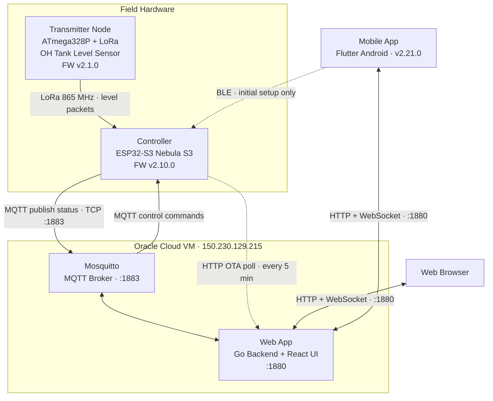
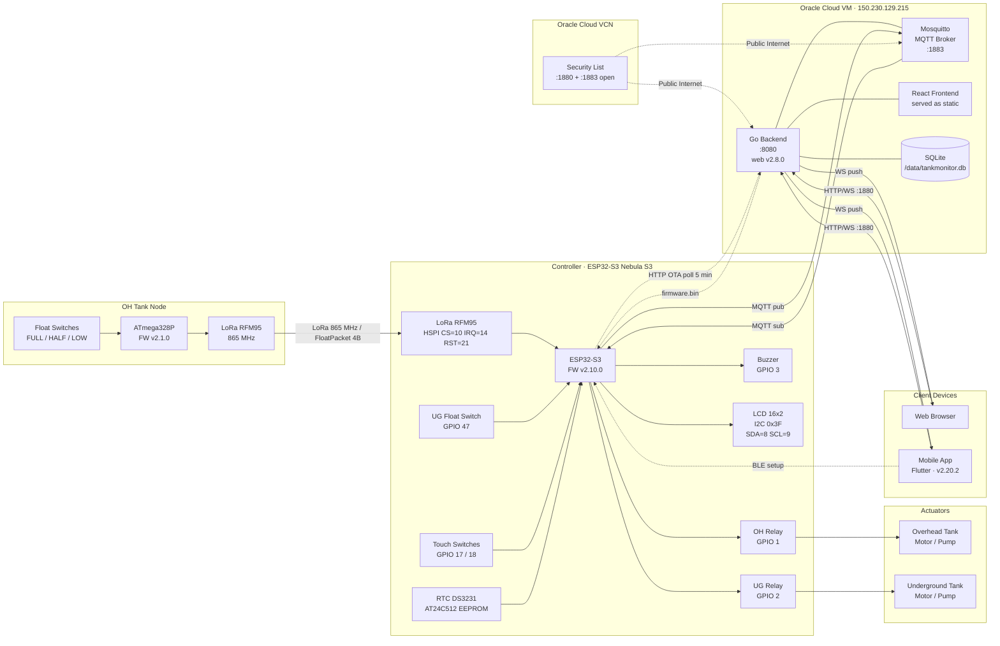

# TankMonitor

Monorepo for the TankMonitor system — ESP32-S3 firmware, Go+React web app, and Flutter mobile app.

---

## Architecture — High-Level Overview



---

## Architecture — Detailed



### Protocol Summary

| Link | Protocol | Port / Medium | Direction |
| --- | --- | --- | --- |
| Transmitter → Controller | LoRa 865 MHz | RF (FloatPacket 4B) | One-way |
| Controller ↔ MQTT Broker | MQTT over TCP | 1883 | Bidirectional |
| Controller → Web App | HTTP | 1880 (OTA poll every 5 min) | Outbound |
| Web App → Controller | HTTP | via MQTT ota_start cmd | Triggered |
| Browser / App ↔ Web App | HTTP REST + WebSocket | 1880 | Bidirectional |
| Mobile App → Controller | BLE | RF | Setup only |
| Internet → VM | Oracle Cloud VCN Security List | 1880 / 1883 | Inbound |

---

## Repository Structure

```text
TankMonitor/
├── controller_firmware/   ESP32-S3 firmware (PlatformIO + Arduino framework)
├── web/                   Go backend + React/Ant Design frontend (Docker-deployed on Oracle Cloud VM)
└── MobileApp/             Flutter Android mobile app
```

## Versions

| Component | Latest |
| --- | --- |
| Controller Firmware | v2.10.0 |
| Transmitter Firmware | v2.1.0 |
| Web App | v2.8.0 |
| Mobile App | v2.21.0 |

---

## Hardware

> Pin map below reflects the **v2.0 PCB**. The v1.x board used I2C SDA=18/SCL=17, UG float GPIO42, touch GPIO40/41, LCD 0x27 — selectable at build time via the `BOARD_V2` flag.

| Component | Details |
| --- | --- |
| Controller | ESP32-S3 Nebula S3 |
| OH Relay | GPIO 1 (RLY1 — Overhead tank motor) |
| UG Relay | GPIO 2 (RLY2 — Underground tank motor) |
| Buzzer | GPIO 3 |
| UG Float Switch | GPIO 47 (INPUT_PULLUP, HIGH=FULL) |
| Touch Switch OH | GPIO 17 |
| Touch Switch UG | GPIO 18 |
| I2C LCD | 16×2, auto-detected at 0x3F (SDA=8, SCL=9) |
| RTC | DS3231 (I2C 0x68) |
| EEPROM | AT24C512 (I2C 0x57) |
| LoRa | RFM95 on HSPI (CS=10, IRQ=14, RST=21) — 865 MHz |
| OH Tank node | ATmega328 + LoRa, float switch (replaces HC-SR04T ultrasonic) |

---

## Credentials & Access

### ESP32 Wi-Fi Access Point (AP mode)

When no home Wi-Fi is configured, or while the device is booting, the ESP32
broadcasts its own AP for initial setup.

| Parameter | Value |
| --- | --- |
| SSID | `TankMonitor` |
| Password | *(see private config)* |
| IP address | `192.168.4.1` |
| Config page | <http://192.168.4.1> |

> **Initial Wi-Fi setup**: Connect your phone/laptop to the `TankMonitor` AP,
> open <http://192.168.4.1> in a browser, and add your home Wi-Fi SSID/password.
> The device will reboot and connect to your home network.

---

### MQTT Broker (Mosquitto on Oracle Cloud VM)

| Parameter | Value |
| --- | --- |
| VM IP | `150.230.129.215` |
| Public domain | `nperiannan-nas.freemyip.com` |
| Port | `1883` (plain) |
| Username | `tankmonitor` |
| Password | *(see private config)* |
| Status topic | `tankmonitor/home/status` |
| Control topic | `tankmonitor/home/control` |
| Logs topic | `tankmonitor/home/logs` |

---

### Web App

| Parameter | Value |
| --- | --- |
| URL | <http://nperiannan-nas.freemyip.com:1880> |
| Username | `admin` |
| Password | *(see private config)* |

---

### Mobile App

Install the latest APK from the [GitHub Releases](https://github.com/nperiannan/TankMonitor/releases/latest).

On first launch:

1. Enter the server URL: `http://nperiannan-nas.freemyip.com:1880`
2. Username: `admin`
3. Password: *(see private config)*

---

## Deployment — Oracle Cloud VM

### Where it runs

| Service | Host | Container name |
| --- | --- | --- |
| Web App | `150.230.129.215:1880` → container port 8080 | `tankmonitor-web` |
| MQTT Broker | `150.230.129.215:1883` | `mosquitto` |

- **OS**: Rocky Linux 9.8 (x86_64, Oracle Always Free tier)
- **DNS**: `nperiannan-nas.freemyip.com` → `150.230.129.215` (static A record)
- **SSH**: `ssh -i ~/.ssh/"Oracle VMs"/rocky/ssh-key-2026-06-06.key hainatraj@150.230.129.215`

### VCN Security List (Oracle Cloud)

The following ingress ports are open in the VCN security list:

| Port | Protocol | Service |
| --- | --- | --- |
| 22 | TCP | SSH |
| 1880 | TCP | Web App |
| 1883 | TCP | MQTT |

### First-time VM setup (sparse checkout — `web/` only)

Run once on the VM via SSH:

```bash
# Sparse clone — fetches objects only for web/
git clone --no-checkout --filter=blob:none \
  https://github.com/nperiannan/TankMonitor.git \
  /opt/TankMonitor

cd /opt/TankMonitor
git sparse-checkout init --cone
git sparse-checkout set web
git checkout master
```

After this the layout is `/opt/TankMonitor/web/{Dockerfile,backend/,frontend/,build_web.sh}`.
Future updates via `git pull` will download only `web/` changes.

---

### Deploy / Update the Web App

SSH into the VM and run:

```bash
cd /opt/TankMonitor/web
bash build_web.sh
```

The script:

1. `git -C .. pull origin master` (pulls latest `web/` changes)
2. `docker build -t tankmonitor-web:<version> .`
3. Stops/removes old container and starts a fresh one with all required env vars

### Check container logs

```bash
docker logs --tail 50 tankmonitor-web
```

---

## Firmware — Flash / OTA

### Serial flash (USB, first-time or recovery)

```bash
cd controller_firmware
pio run -e nebulas3_serial -t upload   # COM7 on Windows
```

### OTA via build script (recommended)

From the `controller_firmware/` directory on Windows:

```powershell
cd controller_firmware
.\build.ps1 -Upload
```

The script builds with PlatformIO (`nebulas3` env), prompts for the device MAC address,
copies `firmware.bin` to the VM via SCP (using your SSH key), and triggers OTA via the web app API.

> **How the ESP32 picks it up:** The firmware polls `GET /api/ota/check/{mac}` on the web app
> (port 1880) every **5 minutes via HTTP** — completely independent of MQTT.  
> When a staged binary exists the web app replies `{"update": true, "url": "..."}` and the
> ESP32 downloads, flashes, and reboots automatically.  
> MQTT does **not** need to be connected for OTA to work.

### OTA via Mobile App

1. Open the app → go to **Settings tab** → **FIRMWARE UPDATE (OTA)**.
2. **Step 1**: tap **Choose firmware.bin** → pick the `.bin` file from your phone.
   An upload progress bar is shown; once complete the file size and upload time appear.
3. **Step 2**: tap **Flash Firmware** → confirm.
4. A 150-second countdown progress bar tracks the update:
   - `triggered` → `ack_received` (ESP32 confirmed) → `downloading` (flashing) → `success`
5. On success the device reboots into the new firmware.

### OTA via Web App

1. Open <http://nperiannan-nas.freemyip.com:1880>, log in.
2. Go to **Firmware Update (OTA)** → click **Upload firmware.bin** → select the `.bin` file.
3. Click **Flash to ESP32** → confirm.
4. A 150-second progress bar tracks the update phases until `success`.

> The binary is staged on the server; the ESP32 fetches it on its next 5-minute HTTP poll
> (`/api/ota/check/{mac}`). No MQTT connection is required for the update to proceed.

---

## Mobile App — Build & Release

```bash
cd MobileApp
flutter build apk --release
# Output: build/app/outputs/flutter-apk/app-release.apk
```

Create a GitHub release with the APK attached:

```powershell
.\release.ps1 -Component MobileApp -Version X.Y.Z -Asset .\build\app\outputs\flutter-apk\app-release.apk -Notes "Description of changes"
```

---

## LCD Backlight Modes

| Mode | Behaviour |
| --- | --- |
| Auto | Off 7:00 AM – 5:30 PM (daytime), On at night |
| On | Always on |
| Off | Always off |

Configurable from the web app (Settings card) or mobile app (Settings section).

---

## Development Workflow (monorepo)

```bash
# Clone
git clone https://github.com/nperiannan/TankMonitor.git
cd TankMonitor

# Work on firmware
 cd controller_firmware && pio run ...
# Work on web app
cd web/frontend && npm run dev     # dev server
cd web && docker build ...         # production

# Work on mobile app
cd MobileApp && flutter run              # debug on device
cd MobileApp && flutter build apk ...    # release APK
```

### Commit & push

```bash
git add -A
git commit -m "component: description"
git push origin master
```

### Create a release

Use the `release.ps1` script — it enforces one release per component, annotated tags, and required assets:

```powershell
.\release.ps1 -Component web -Version 2.1.0 -Notes "Fixed X; Added Y"
.\release.ps1 -Component controller_firmware -Version 2.1.0 -Asset .\build\firmware.bin -Notes "Fixed Z"
.\release.ps1 -Component MobileApp -Version 2.0.1 -Asset .\build\app-release.apk -Notes "Bug fix"
.\release.ps1 -Component transmitter_firmware -Version 2.0.1 -Asset .\build\firmware.hex -Notes "Cal fix"
```

### Sync a subfolder from its old repo (one-off)

```bash
git subtree pull --prefix=controller_firmware https://github.com/nperiannan/Tank-Monitor-Float.git master
git subtree pull --prefix=web      https://github.com/nperiannan/TankMonitor-Web.git master
git subtree pull --prefix=MobileApp https://github.com/nperiannan/TankMonitor-App.git master
```
